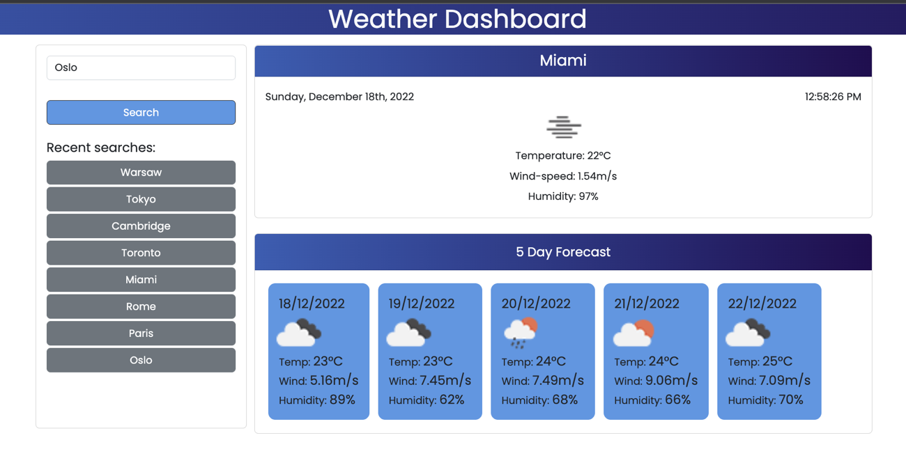

# Weatherdash 
Weather Dashboard using api.openweathermap.org to display current weather conditions and 5 day forecast based on user input.

## Stored and deployed:
* https://github.com/stevelab1/weatherdash

* Deployed app URL: 

## Screenshot

The following image shows the web application's appearance and functionality:

## Uses:
* HTML, CSS, Javascript
* Bootstrap, Moment, jQuery
* OpenWeather API
* Local Storage

## Credits

2U

---